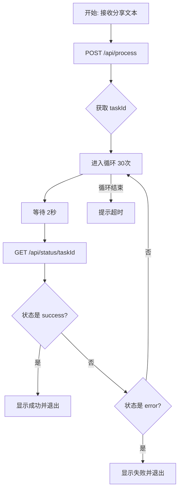

# iOS 快捷指令配置指南 (轮询版)

本指南将帮助你配置 iOS 快捷指令，实现从各大平台分享链接并自动转存到网易云音乐的功能。

由于转码和上传可能需要较长时间，为了防止快捷指令超时，我们采用了 **“提交任务 -> 轮询状态”** 的机制。

## 🚀 快速开始 (推荐)

最简单的方法是直接导入我配置好的快捷指令，然后修改服务器地址和 Cookie。

👉 **[点击导入 iCloud 快捷指令](https://www.icloud.com/shortcuts/569b4aaa381e4bac8dfee0238195ea6a)**

**导入后只需做以下修改**：
1. **修改服务器地址**：找到快捷指令中的 `URL` 字段，将 `http://<你的服务器IP>:3000` 替换为你实际的服务器 IP 或域名。
2. **配置 Cookies**：找到顶部的 `CookiesConfig` 字典，填入你的 `neteaseCookie` (必填) 以及其他平台的 Cookie。

---

## 🛠 手动制作指南

如果你想自己动手制作，或者需要理解其工作原理，请参考以下步骤。

### 核心原理
1. **提交任务**：客户端发送请求，服务器立即返回 `taskId`，不等待处理完成。
2. **轮询等待**：客户端进入循环，每隔几秒询问服务器“好了吗？”。
3. **获取结果**：一旦服务器返回 `success`，客户端显示结果。

### 详细步骤

#### 1. 准备输入
- 开启 **“在共享表中显示”** (Show in Share Sheet)。
- 获取 **“快捷指令输入”** (Shortcut Input)。
- 添加动作 **“获取文本”** (Get Text)，将“快捷指令输入”作为输入。
  - *目的：确保我们获取的是纯文本，避免 iOS 自动识别出错误的 URL (如 mailto)。*

#### 2. 设置 Cookies (字典)
- 添加动作 **“字典”** (Dictionary)，重命名为 `CookiesConfig`。
- 添加以下文本项 (Text)：
  - `neteaseCookie`: 你的网易云 Cookie (**必填**)
  - `douyinCookie`: 抖音 Cookie (选填)
  - `bilibiliCookie`: Bilibili Cookie (选填)
  - `youtubeCookie`: YouTube Cookie (选填)

#### 3. 提交任务 (POST /api/process)
- 添加动作 **“获取 URL 内容”** (Get Contents of URL)。
- **配置详情**：
  - **URL**: `http://<你的服务器IP>:3000/api/process`
  - **方法** (Method): `POST`
  - **请求体** (Request Body): `JSON`
  - **添加字段**：
    - `url`: (选择步骤1的“文本”)
    - `cookies`: (选择步骤2的“CookiesConfig”字典)
- **获取 TaskID**：从上一步的结果中获取值，键名为 `taskId`。

#### 4. 轮询循环 (Polling Loop)
- 添加动作 **“重复”** (Repeat)。设置重复次数（例如 **30次**，每次等待2秒，相当于最长等待60秒）。
- **在“重复”循环内部**：
  1. **等待** (Wait)：设置为 **2秒**。
  2. **查询状态**：添加 **“获取 URL 内容”**。
     - **URL**: `http://<你的服务器IP>:3000/api/status/<taskId>` 
       - *注意：把 `<taskId>` 替换为步骤3获取的变量。*
     - **方法**: `GET`
  3. **获取状态值**：从查询结果中获取值，键名为 `status`。
  4. **判断是否完成**：
     - 添加动作 **“如果”** (If) `status` **是** `success`：
       - **显示通知**：上传成功！(可以获取 `result` 字段里的歌名显示)
       - **退出快捷指令** (Exit Shortcut)
     - **否则**：
       - **如果** `status` **是** `error`：
          - **显示通知**：任务失败 (获取 `message` 字段显示原因)
          - **退出快捷指令**
       - **结束如果**
     - **结束如果**
- **结束重复**

#### 5. 超时处理
- 在“结束重复”的后面（循环外），添加一个 **“显示通知”**：
  - 内容：“任务处理超时，请稍后在网易云查看结果。”
  - *(这意味着循环跑完了30次还没结束，但服务器后台可能还在跑)*

## 流程图示

