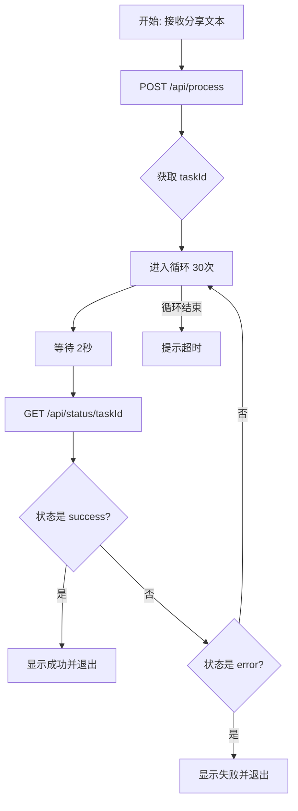

# iOS 快捷指令配置指南 (轮询版)

本指南将帮助你配置 iOS 快捷指令，实现从各大平台分享链接并自动转存到网易云音乐的功能。

由于转码和上传可能需要较长时间，为了防止快捷指令超时，我们采用了 **"提交任务 -> 轮询状态"** 的机制。

## 🔄 新功能：青龙面板 Cookie 获取

服务器支持从青龙面板的环境变量中自动获取网易云音乐、B站和抖音的 Cookie，这样你就不需要手动在快捷指令中填写这些 Cookie 了。

### 配置说明

1. **访问服务器设置页面**：打开 `http://<你的服务器IP>:3000`，点击设置按钮。

2. **配置青龙面板连接**：
   - **启用青龙面板**：勾选此选项
   - **青龙面板地址**：例如 `http://192.168.1.100:5700`
   - **Client ID** 和 **Client Secret**：在青龙面板中创建应用获取
   - **网易云音乐 Cookie 环境变量名**：默认为 `netease_cookie`
   - **B站 Cookie 环境变量名**：默认为 `bilibili_cookie`
   - **抖音 Cookie 环境变量名**：默认为 `douyin_cookie`

3. **在青龙面板创建应用**：
   - 登录青龙面板 → 系统设置 → 应用设置 → 添加应用
   - 权限勾选"环境变量"
   - 保存后获取 Client ID 和 Client Secret

4. **在青龙面板添加 Cookie 环境变量**：
   
   登录青龙面板 → 环境变量 → 新建变量，分别添加以下变量：

   | 名称 | 值 | 备注 |
   |------|-----|------|
   | `netease_cookie` | 你的网易云 Cookie | **必须包含 MUSIC_U 字段** |
   | `bilibili_cookie` | 你的 B站 Cookie | 包含 SESSDATA 和 bili_jct |
   | `douyin_cookie` | 你的抖音 Cookie | 包含 sessionid 等字段 |

   > [!IMPORTANT]
   > **获取 Cookie 的方法**：
   > 1. 在浏览器登录对应网站（如 music.163.com）
   > 2. 按 F12 打开开发者工具 → Application/应用 → Cookies
   > 3. 复制所有 Cookie 内容（格式：`key1=value1; key2=value2`）
   > 4. 粘贴到青龙面板的环境变量值中

   **网易云 Cookie 示例**：
   ```
   MUSIC_U=xxx; __csrf=yyy; ...
   ```

   添加完成后，服务器会自动从青龙获取这些 Cookie，无需在快捷指令中重复配置。

### 优先级规则

| 来源 | 优先级 |
|------|--------|
| 快捷指令传入的 Cookie | **最高** |
| 青龙面板环境变量获取的 Cookie | **其次** |
| 服务器本地配置的 Cookie | **最低** |

> [!TIP]
> 如果你已经在用青龙面板管理各平台的 Cookie（例如 JD、B站签到等脚本），开启此功能后，服务器会自动从青龙获取最新的 Cookie，无需手动同步更新。

---

## 🚀 快速开始 (推荐)

最简单的方法是直接导入我配置好的快捷指令，然后修改服务器地址和 Cookie。

👉 **[点击导入 iCloud 快捷指令](https://www.icloud.com/shortcuts/569b4aaa381e4bac8dfee0238195ea6a)**

**导入后只需做以下修改**：
1. **修改服务器地址**：找到快捷指令中的 `URL` 字段，将 `http://<你的服务器IP>:3000` 替换为你实际的服务器 IP 或域名。
2. **配置 Cookies**：找到顶部的 `CookiesConfig` 字典，填入你的 `neteaseCookie` (必填) 以及其他平台的 Cookie。

> [!NOTE]
> 如果你已经在服务器上配置了青龙面板获取 Cookie，快捷指令中的 `douyinCookie` 和 `bilibiliCookie` 可以留空，服务器会自动从青龙获取。

---

## 🛠 手动制作指南

如果你想自己动手制作，或者需要理解其工作原理，请参考以下步骤。

### 核心原理
1. **提交任务**：客户端发送请求，服务器立即返回 `taskId`，不等待处理完成。
2. **轮询等待**：客户端进入循环，每隔几秒询问服务器"好了吗？"。
3. **获取结果**：一旦服务器返回 `success`，客户端显示结果。

### 详细步骤

#### 1. 准备输入
- 开启 **"在共享表中显示"** (Show in Share Sheet)。
- 获取 **"快捷指令输入"** (Shortcut Input)。
- 添加动作 **"获取文本"** (Get Text)，将"快捷指令输入"作为输入。
  - *目的：确保我们获取的是纯文本，避免 iOS 自动识别出错误的 URL (如 mailto)。*

#### 2. 设置 Cookies (字典)
- 添加动作 **"字典"** (Dictionary)，重命名为 `CookiesConfig`。
- 添加以下文本项 (Text)：
  - `neteaseCookie`: 你的网易云 Cookie (**必填**，除非在服务器本地设置中配置)
  - `douyinCookie`: 抖音 Cookie (**选填**，如果配置了青龙，可留空)
  - `bilibiliCookie`: Bilibili Cookie (**选填**，如果配置了青龙，可留空)
  - `youtubeCookie`: YouTube Cookie (选填)

> [!NOTE]
> **关于青龙面板集成**：
> - 青龙面板的 Cookie 获取是**服务器端**自动完成的
> - 快捷指令中，你只需把相应的 Cookie **留空**（或填入空字符串 `""`）
> - 服务器收到请求后会自动从青龙获取 Cookie
> - **不需要在快捷指令中添加任何获取青龙 Cookie 的步骤**

#### 3. (可选) 配置青龙面板

如果你想使用青龙面板自动获取 Cookie，可以添加青龙配置：

- 添加动作 **"字典"** (Dictionary)，重命名为 `QinglongConfig`。
- 添加以下项：
  - `enabled` (布尔值/Boolean): 设置为 `true` 启用青龙
  - `url` (文本/Text): 青龙面板地址，例如 `http://192.168.1.100:5700`
  - `clientId` (文本/Text): 青龙应用的 Client ID
  - `clientSecret` (文本/Text): 青龙应用的 Client Secret
  - `neteaseEnvName` (文本/Text): 网易云 Cookie 环境变量名，默认 `netease_cookie`
  - `bilibiliEnvName` (文本/Text): B站 Cookie 环境变量名，默认 `bilibili_cookie`
  - `douyinEnvName` (文本/Text): 抖音 Cookie 环境变量名，默认 `douyin_cookie`

> [!TIP]
> **如果不使用青龙面板**：
> - 可以跳过此步骤，或将 `enabled` 设置为 `false`
> - 直接在步骤 2 中填写 Cookie
>
> **使用青龙面板的好处**：
> - Cookie 自动同步，无需手动更新快捷指令
> - 多设备共享配置（所有设备使用同一青龙配置）
> - 统一管理各平台 Cookie

#### 4. 提交任务 (POST /api/process)
- 添加动作 **"获取 URL 内容"** (Get Contents of URL)。
- **配置详情**：
  - **URL**: `http://<你的服务器IP>:3000/api/process`
  - **方法** (Method): `POST`
  - **请求体** (Request Body): `JSON`
  - **添加字段**：
    - `url`: (选择步骤1的"文本")
    - `cookies`: (选择步骤2的"CookiesConfig"字典)
    - `qinglongConfig`: (如果配置了青龙，选择步骤3的"QinglongConfig"字典；否则可留空或删除此字段)
- **获取 TaskID**：从上一步的结果中获取值，键名为 `taskId`。

#### 5. 轮询循环 (Polling Loop)
- 添加动作 **"重复"** (Repeat)。设置重复次数（例如 **30次**，每次等待2秒，相当于最长等待60秒）。
- **在"重复"循环内部**：
  1. **等待** (Wait)：设置为 **2秒**。
  2. **查询状态**：添加 **"获取 URL 内容"**。
     - **URL**: `http://<你的服务器IP>:3000/api/status/<taskId>` 
       - *注意：把 `<taskId>` 替换为步骤3获取的变量。*
     - **方法**: `GET`
  3. **获取状态值**：从查询结果中获取值，键名为 `status`。
  4. **判断是否完成**：
     - 添加动作 **"如果"** (If) `status` **是** `success`：
       - **显示通知**：上传成功！(可以获取 `result` 字段里的歌名显示)
       - **退出快捷指令** (Exit Shortcut)
     - **否则**：
       - **如果** `status` **是** `error`：
          - **显示通知**：任务失败 (获取 `message` 字段显示原因)
          - **退出快捷指令**
       - **结束如果**
     - **结束如果**
- **结束重复**

#### 6. 超时处理
- 在"结束重复"的后面（循环外），添加一个 **"显示通知"**：
  - 内容："任务处理超时，请稍后在网易云查看结果。"
  - *(这意味着循环跑完了30次还没结束，但服务器后台可能还在跑)*

## 流程图示


```mermaid
graph TD
    Start[开始: 接收分享文本] --> Request[POST /api/process]
    Request --> GetID{获取 taskId}
    GetID --> Loop[进入循环 30次]
    Loop --> Wait[等待 2秒]
    Wait --> Check[GET /api/status/taskId]
    Check --> IsSuccess{状态是 success?}
    IsSuccess -- 是 --> ShowSuccess[显示成功并退出]
    IsSuccess -- 否 --> IsError{状态是 error?}
    IsError -- 是 --> ShowError[显示失败并退出]
    IsError -- 否 --> Loop
    Loop -- 循环结束 --> Timeout[提示超时]
```
